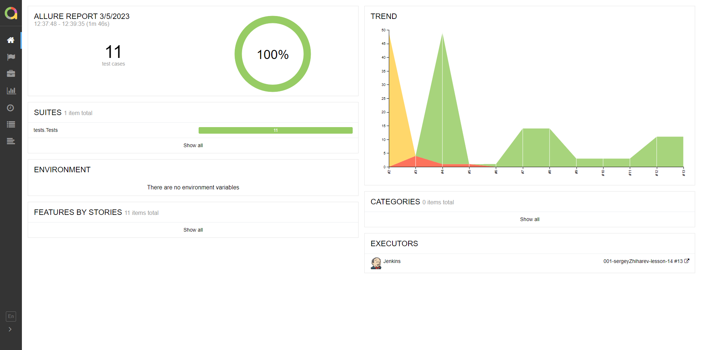
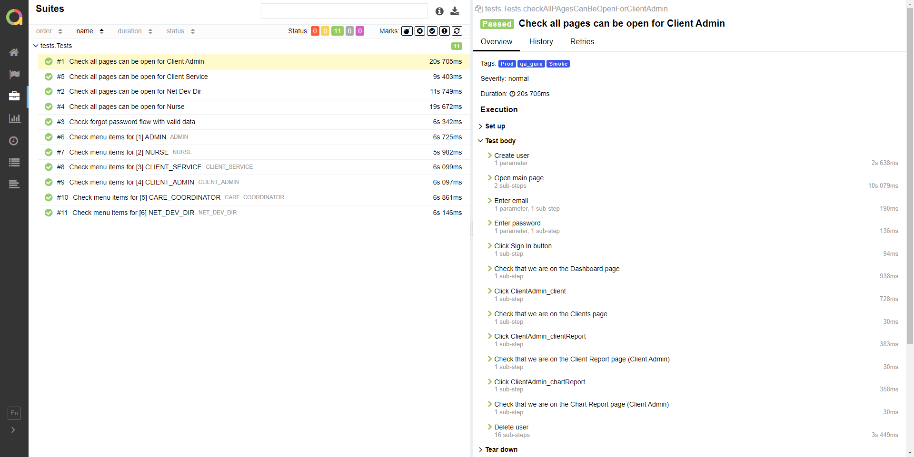
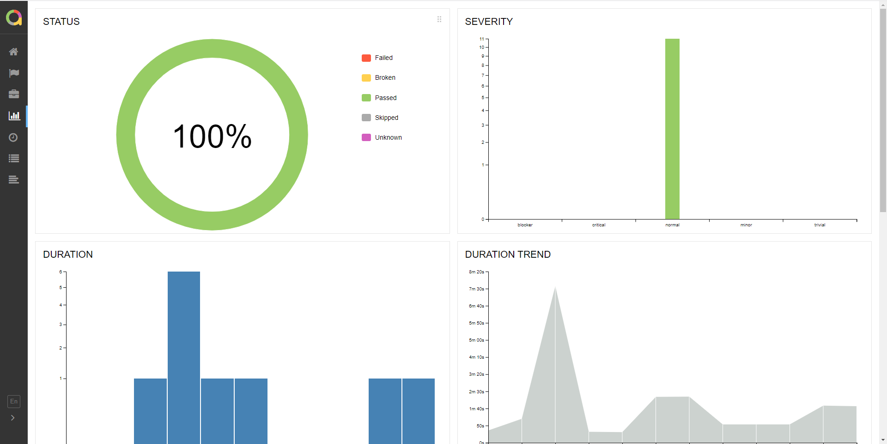
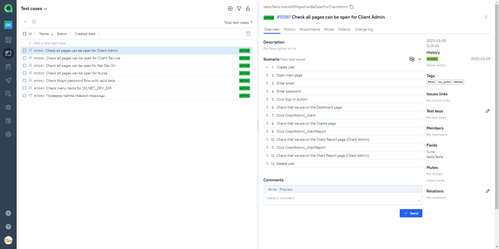
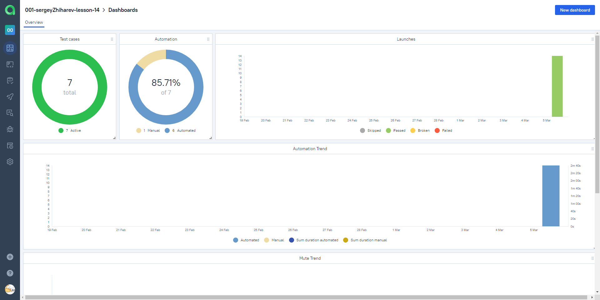
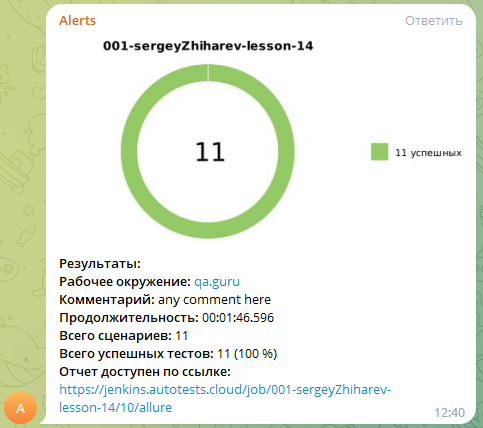
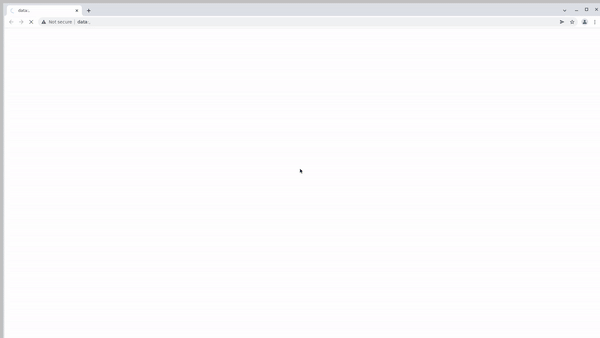

<h1> Автоматизации тестирования для CRM системы приложения <a href="https://pricemds.com/">PriceMDs</a></h1>

<h3>Содержание:</h3>

- <a href="#tools">Технологии и инструменты</a>
- <a href="#checks">Перечень проверок</a>
- <a href="#launch">Запуск тестов</a>
- <a href="#report">Allure-отчет</a>
- <a href="#testops">Интеграция с Allure TestOps</a>
- <a href="#telegram">Интеграция с Telegram</a>
- <a href="#video">Видео пример прохождения тестов</a>

<h2 name="tools">:memo:Технологии и инструменты:memo:</h2>

<h2 name="checks">Перечень проверок</h2>
<h3>Автоматизированные тесты</h3>

- [x] Возможность открытия всех страниц сайта посредством меню для роли Client Admin
- [x] Возможность открытия всех страниц сайта посредством меню для роли Client Service
- [x] Возможность открытия всех страниц сайта посредством меню для роли Net Dev Dir
- [x] Возможность открытия всех страниц сайта посредством меню для роли Nurse
- [x] Проверка отправки письма для восстановления пароля
- [x] Параметризированный тест для точной проверки всех меню и подменю для ролей Nurse, Net Dev Dir, Client Service, Client Admin, Admin, Care Coordinator

<h3>Ручные тесты</h3>

- [x] Проверка тайтла главной страницы

<h2 name="launch">Запуск тестов</h2>

<h3>Локальный запуск</h3>
Запуск с использованием командной строки:
<pre>
gradle clean test
</pre>
<h3>Удаленный запуск с параметрами:</h3>
Пример настройки параметров Jenkins
<pre>
clean ${RUN_OPTION} "-Dbrowser=${BROWSER}" "-DbrowserVersion=${VERSION}" "-DbrowserSize=${RESOLUTION}" "-Dremote=${SELENOID_CLOUD}"
</pre>

<h3>Проект в Jenkins:</h3>
<ol>
<li>Открыть <a target="_blank" href="https://jenkins.autotests.cloud/job/001-sergeyZhiharev-lesson-14/">проект</a> в Jenkins</li>
<li>Выбрать пункт "Собрать с параметрами"</li>
<li>В случае необходимости изменить параметры, выбрав значения из выпадающих списков</li>
<li>Нажать "Собрать"</li>
<li>Результат запуска сборки можно посмотреть в отчёте Allure</li>
</ol>

<h2 name="report">Allure-отчет</h2>

<h3>Главное окно</h3>

<h3>Тесты</h3>

<h3>Графики</h3>

<h2 name="testops">Интеграция с Allure TestOps</h2>
<h3>Общий список всех тест-кейсов</h3>

<h3>Dashboard</h3>

<h2 name="telegram">Интеграция с Telegram</h2>

<h2 name="#video">Видео пример прохождения тестов</h2>

